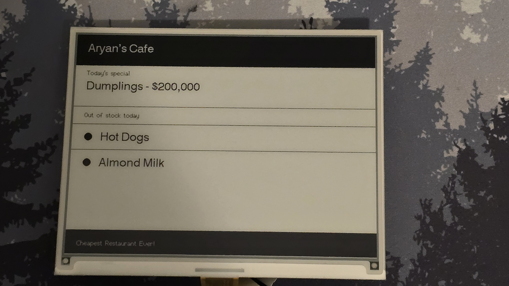

# E-Ink-Dashboard

Hi! My name is Aryan, and I made this E-Ink dashboard for local businesses. 

The entire thing is powered by an ESP-32-S3-Plus found on the EE04 board from Seed Studio. The board is then connected to an e-paper screen, which displays the business name, a specialty item, an additional message, and what they are out of. 

This is all saved and customizable through a web page it hosts. All of the code is flashed through a sketch through Arduino IDE. All of the sketches' tabs/code are available in this repository. The full guide on how I made it and what I specifically used is on: https://www.hackster.io/aryanjain9818/quick-glance-410bd3. 

If you copy what I made, you can copy all of the code and paste it into your Arduino IDE; CHANGE THE WIFI AND PASSWORD in the web server script to yours, and flash it. You can check the IP it's on through the serial monitor at 115,200 baud. That's all! If you do all that, it should all work :) 
